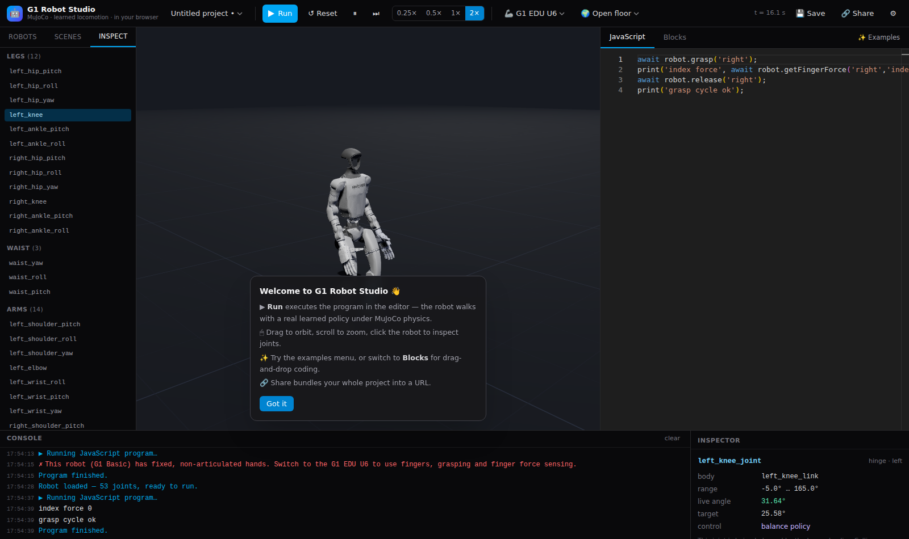

# G1 Robot Studio — humanoid simulation in your browser

A fully client-side 3D robot simulation studio for the **Unitree G1** humanoid.
Real **MuJoCo** physics (WebAssembly), **learned-policy locomotion** (ONNX
Runtime Web) — the robot genuinely balances, walks, turns, and falls — with
behavior authored in **JavaScript** (Monaco) or **drag-and-drop blocks**
(Blockly). No backend: everything runs in your browser tab.



## Features

- **Two robots**, generated from official Unitree description files:
  - **G1 Basic** — 23 DOF, fixed rubber hands
    (`g1_23dof_rev_1_0` MJCF, verbatim joint names/limits)
  - **G1 EDU U6** — 41 actuated DOF: 29-DOF body + two **Inspire RH56DFTP**
    five-finger hands (6 DOF / 12 joints per hand, coupled linkages modelled
    as MuJoCo equality constraints, fingertip touch sensors), converted from
    Unitree's official `g1_29dof_rev_1_0_with_inspire_hand_FTP.urdf`
- **Learned locomotion, not scripted animation**: a 29-slot joystick walking
  policy (ONNX, ~880 KB) runs at 50 Hz against 200 Hz MuJoCo physics inside a
  Web Worker. Push the robot, take its knees away from the policy, walk it
  into a table — it falls like a robot falls.
- **One `robot` API, two authoring modes**: Monaco JS with per-robot
  typings/autocomplete, and Blockly blocks that compile to the same
  JavaScript and run through the same sandboxed worker.
- **Inspector**: click any robot part (or the joint list) for name, type,
  limits, live angle, target and controller ownership; live IMU/touch sensor
  readouts; collision-geometry overlay toggle.
- **Projects**: save/load in localStorage, **share via URL fragment**
  (lz-string compressed — nothing leaves the browser), file export/import
  fallback for large projects.
- **Scenes**: open floor, table + graspable block, obstacle yard.
- **Drive mode**: keyboard teleop (W/S/A/D + Q/E) streaming joystick
  commands straight to the balance policy.

## Architecture

| Layer | Technology |
|---|---|
| App shell | React 19 + TypeScript + Vite + Tailwind CSS 4 |
| 3D rendering | three.js + @react-three/fiber (meshes come from MuJoCo's own processed vertex buffers, so visuals match physics exactly) |
| Physics | **official `mujoco` npm package** (Google DeepMind WASM bindings, MuJoCo 3.x) in a dedicated sim worker |
| Locomotion policy | ONNX Runtime Web (wasm EP) in the same worker — obs → action → PD position targets, synchronous with stepping |
| User code | Separate sandbox worker; `robot` API RPCs go straight to the sim worker over a `MessageChannel`; ping/pong watchdog kills busy-wait loops |
| Frames | `SharedArrayBuffer` double buffer (page is cross-origin isolated); postMessage fallback |
| State | Zustand |
| Persistence | lz-string + localStorage + URL fragment |

```
main thread                     sim worker                    code worker
┌────────────┐  load/play/…  ┌───────────────────┐  RPCs   ┌─────────────┐
│ React UI   │──────────────▶│ MuJoCo WASM 200Hz │◀────────│ user JS in  │
│ three.js   │◀── frames ────│ ONNX policy 50Hz  │────────▶│ AsyncFunction│
│ Monaco     │   (SAB)       │ task engine       │ results │ + robot API │
│ Blockly    │               └───────────────────┘         └─────────────┘
└────────────┘
```

### The locomotion policy (matched pair)

`public/assets/policies/walker.onnx` is a joystick-style walking policy
(99-D observation → 29-D action, MuJoCo-Playground-style training) taken from
the public [luckyrobots/g1-manipulation-challenge](https://github.com/luckyrobots/g1-manipulation-challenge)
repo, which also provided the policy-matched 29-DOF MJCF (PD gains, armature,
foot collision capsules, IMU sites). Observation layout:

```
[ base lin vel (3, base frame) | base ang vel (3) | projected gravity (3)
| joint pos − default (29) | joint vel (29) | last action (29) | command (3) ]
```

**Per-robot strategy** (each robot uses the same 29-slot interface):

- **G1 EDU U6**: all 29 body joints exist — the policy drives legs + waist;
  arm slots are held at user-controlled targets (so `robot.moveJoint` works
  while walking); fingers are driven by the grasp API, never the policy.
- **G1 Basic**: the 6 slots with no physical joint (waist roll/pitch, wrist
  pitch/yaw ×2) read as "at default pose, zero velocity" in the observation
  and their actions are dropped — physically equivalent to welding them,
  which is exactly what the 23-DOF hardware is. Validated headless: the
  Basic stands, walks at commanded speed, turns, and falls when shoved.

`robot.setJoint()` on a policy-owned joint deliberately takes it away from
the balance controller (with a console warning) — instructive, and usually
ends on the floor. `walk/stand/setVelocity` gives it back.

## The `robot` API

Motion/time methods are **async** (await them — they resolve when the motion
completes). Read/instant methods are **synchronous** (per brief §5): getters
read a live snapshot of sim state, instant setters fire-and-forget with
synchronous validation. Awaiting a synchronous method still works, so both
`robot.getJoint(x)` and `await robot.getJoint(x)` are valid.

```js
// async — resolves on completion
await robot.walkForward(meters, speed?)   // learned policy does the stepping
await robot.walkBackward(meters, speed?)
await robot.turn(degrees)                 // + = left
await robot.stand()
await robot.moveJoint(name, degrees, seconds)
await robot.wait(seconds)
await robot.grasp(hand, strength?)        // EDU U6; resolves when fingers settle
await robot.release(hand)                 // EDU U6

// synchronous — return a value / void immediately
robot.listJoints()                        // string[]
robot.listSensors()                       // string[]
robot.getJoint(name)                      // number (degrees)
robot.getSensor('imu-pelvis-angular-velocity')  // number | number[]; + base_* virtuals
robot.getPose()                           // { position, quaternion, yawDeg }
robot.setJoint(name, degrees)             // void
robot.setVelocity(vx, vy, yawRate)        // void — stream a joystick command
robot.setFinger(hand, finger, amount)     // void; EDU U6; 0 open … 1 curled
robot.getFingerForce(hand, finger)        // number (N); EDU U6
print(...)
```

`getSensor(name)` matches exactly, then case-insensitively by substring, then
by sensor kind (`gyro`/`accelerometer`/`touch`), so `getSensor('imu')` or
`getSensor('gyro')` find the right sensor without needing the full MJCF name.

The sandbox keeps running until the program is actually idle, so a detached
`main().catch(...)` (instead of `await main()`) completes correctly.

## Development

```sh
npm install
npm run dev        # vite dev server (COOP/COEP headers included)
npm run build      # tsc + vite build -> dist/
npm run preview    # serve the production build

# regenerate robot models from vendored Unitree/policy sources
pip install mujoco numpy onnxruntime trimesh fast-simplification
npm run models     # tools/build_models.py -> public/assets/robots/*.xml
npm run validate   # headless: stands / walks / turns / falls on both robots

# browser end-to-end suite (needs a chromium + `npm i --no-save playwright`)
npx vite preview --port 4173 &
node tools/e2e/e2e_check.mjs
```

### Deploying (Vercel, fully static)

`vercel.json` sets the required **COOP/COEP** headers so the page is
cross-origin isolated (`crossOriginIsolated === true` → SharedArrayBuffer
frame streaming; the app logs a console warning and falls back to
postMessage otherwise). Everything — WASM, ONNX, meshes, editors, Blockly
media — is self-hosted, so `COEP: require-corp` blocks nothing. Deploy with
`vite build` and serve `dist/`.

Notable WASM gotchas handled here (see `vite.config.ts` / `simWorker.ts`):

- The `mujoco` npm build is pthread-enabled. Emscripten glue must **not** be
  bundled — it is served verbatim from `/vendor/mujoco/` and imported at
  runtime, so its `import.meta.url` worker self-spawning stays intact.
  Same treatment for ONNX Runtime (`/vendor/ort/`).
- Robot MJCFs set `<compiler usethread="false"/>` — threaded model
  compilation deadlocks inside the synchronous `mj_loadXML` call in a
  browser worker.

## Asset provenance & licenses

| Asset | Source | License |
|---|---|---|
| G1 meshes + MJCF/URDF | [unitreerobotics/unitree_ros](https://github.com/unitreerobotics/unitree_ros) `g1_description` | BSD-3-Clause |
| Inspire RH56DFTP hand model | same repo (`..._with_inspire_hand_FTP.urdf`), converted to MJCF via MuJoCo | BSD-3-Clause |
| Walking policy (`walker.onnx`) + policy-matched MJCF setup | [luckyrobots/g1-manipulation-challenge](https://github.com/luckyrobots/g1-manipulation-challenge) | public challenge repo (no license file) — used with attribution |
| MuJoCo WASM | [`mujoco` npm](https://www.npmjs.com/package/mujoco) (Google DeepMind) | Apache-2.0 |
| ONNX Runtime Web | Microsoft | MIT |
| Blockly, three.js, Monaco | Google / three.js / Microsoft | Apache-2.0 / MIT / MIT |

Meshes are decimated (~65%) for the web; regenerate with the original STLs
via `tools/build_models.py` if you need full-resolution visuals.

## Repository layout

```
public/assets/robots/     generated MJCFs (g1_basic, g1_edu_u6)
public/assets/scenes/     flat / table / obstacles MJCF scenes
public/assets/meshes/     shared STL pool (Unitree + Inspire, decimated)
public/assets/policies/   walker.onnx (+ external data) + metadata
src/engine/               sim worker (MuJoCo + ONNX + task engine) + client
src/sandbox/              user-code worker + watchdog runner
src/editor/  src/blocks/  Monaco / Blockly authoring layers
src/render/               three.js viewport fed by MuJoCo frames
src/state/  src/persistence/  zustand store, actions, projects & sharing
tools/                    model generation, headless validation, e2e suite
tools/vendor/             vendored Unitree/policy source files
```
